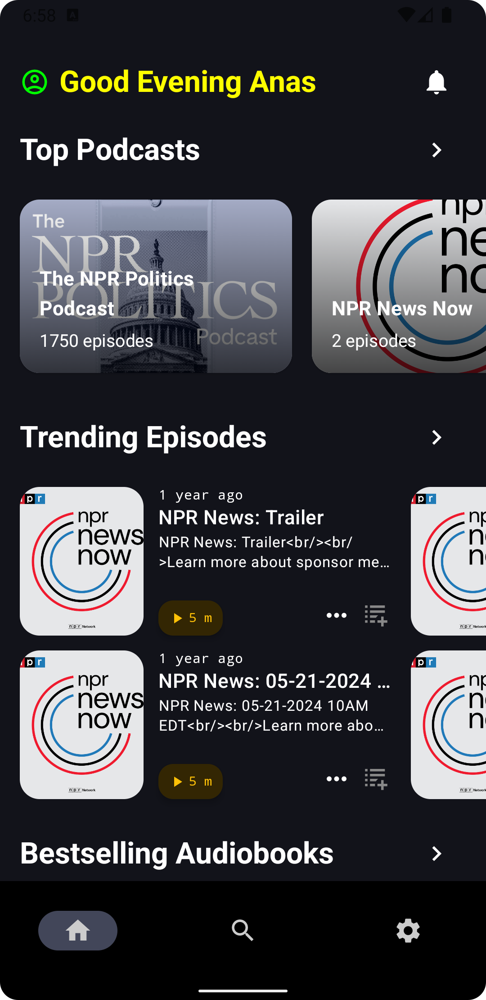

# 🎧 ReadCast

**ReadCast** is a sleek and modern Android application that combines the world of **podcasts** and **audiobooks** in one seamless, user-friendly interface. Designed with Jetpack Compose and built for performance and elegance, ReadCast is your one-stop app for staying informed and entertained.



---

## ✨ Features

- 🔥 **Trending Podcasts & Episodes**  
  Curated collections of the most popular and up-to-date podcasts.

- 📚 **Top Audiobooks**  
  Discover bestselling audiobooks right from the home screen.

- ⏱️ **Episode Details & Playback Time**  
  View duration and playback episodes instantly.

- 📱 **Modern UI with Jetpack Compose**  
  Responsive, animated, and clean UI tailored for Android 12+.

- 🌙 **Dark Theme Support**  
  Eye-friendly design, especially in night mode.

---

## 🧩 Tech Stack

- **Kotlin**
- **Jetpack Compose**
- **Paging 3**
- **Hilt (Dependency Injection)**
- **Coil (Image Loading)**
- **Kotlin Flows**
- **MVVM + Clean Architecture**

---

## 🚀 Getting Started

### Prerequisites

- Android Studio Flamingo or later
- Kotlin 1.9+
- Minimum SDK 24+

### Installation

```bash
git clone https://github.com/your-username/readcast.git
cd readcast
./gradlew installDebug
```

---

## 🧪 Testing

```bash
./gradlew test
```

Unit tests cover use cases and view models to ensure stability.


---

## 🤝 Contributing

Pull requests are welcome! For major changes, please open an issue first to discuss what you’d like to change.

---

## 📄 License

Distributed under the MIT License. See `LICENSE` for more information.

---

## 👨‍💻 Author

**Anas** – [GitHub Profile](https://github.com/your-username)  
Feel free to reach out or fork the project!
